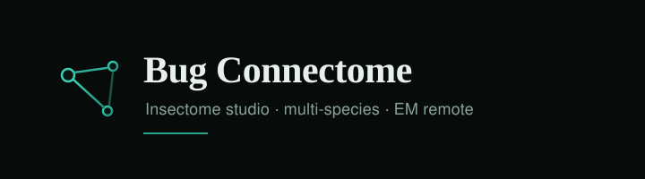

<p align="center">
  
</p>

<h1 align="center">Insectome</h1>

<p align="center">
  <strong>Local multi-species insect connectome studio</strong><br/>
  Browse real reconstructions by silhouette and cell class · zoom into neuron roles · keep EM remote
</p>

<p align="center">
  <a href="https://theworker02.github.io/new-connectome-project/"></a>
  <a href="https://github.com/theworker02/new-connectome-project/actions/workflows/pages.yml"></a>
</p>

<p align="center">
  
  
  
  
  
  
  
</p>

<p align="center">
  <a href="#quick-start">Quick start</a> ·
  <a href="#live-site">Live site</a> ·
  <a href="#what-insectome-is">What it is</a> ·
  <a href="#what-it-includes">What it includes</a> ·
  <a href="#acquisition-ready">Acquisition-ready</a> ·
  <a href="#studio--cli">Studio &amp; CLI</a> ·
  <a href="#documentation">Docs</a>
</p>

---

## Why Insectome exists

Insect connectomics has an abundance of **already-reconstructed** public data (neuPrint hemibrain / MANC / optic lobe, CREMI, Insect Brain Database projectomes) and a shortage of tools that:

1. **Reuse first** — prefer LEVEL-0 / LEVEL-1 public graphs over re-segmenting EM.
2. **Stay honest** — never invent a merged “insectome,” never claim synaptic connectivity without evidence, never pretend a CX pack is a whole brain.
3. **Fit a laptop** — cache ≤10 GB hard ceiling; raw EM stays remote / on-demand; dense catalogs are index-first (parquet / JSON), not multi-GB skeleton dumps.
4. **Feel visual** — browse by silhouette and cell class, then zoom into roles and partners — not endless ID lists.

Insectome is that studio: a **federated, provenance-tracked** client over multi-species packs, with an optional **static GitHub Pages** snapshot for sharing.

---

## Live site

| Surface | URL | Mode |
|---|---|---|
| **GitHub Pages demo** | [theworker02.github.io/new-connectome-project](https://theworker02.github.io/new-connectome-project/) | Static JSON snapshot (read-only) |
| **Repository** | [github.com/theworker02/new-connectome-project](https://github.com/theworker02/new-connectome-project) | Source + docs + Actions |
| **Local studio** | `http://127.0.0.1:8765` after `insectome open` | Full API + packs + autonomy |

The Pages build ships ~**23 MB** of compact catalogs + LOD silhouettes (not the 1.7 GB local pack footprint). Autonomy ingestion, cache clearing, and EM evidence cutouts remain **local-only**.

---

## Quick start

### Requirements

| Tool | Notes |
|---|---|
| **Python** | ≥ 3.11 |
| **Node.js** | ≥ 18 (only needed to rebuild the React studio UI) |
| **Optional** | neuPrint token for LEVEL-0 imports (`NEUPRINT_APPLICATION_CREDENTIALS` or `NEUPRINT_TOKEN`) |

### Install (acquisition-ready)

```bash
git clone https://github.com/theworker02/new-connectome-project.git
cd new-connectome-project

python -m venv .venv
# Windows
.venv\Scripts\activate
# macOS / Linux
source .venv/bin/activate

pip install -e ".[dev,neuprint]"
```

### One-command studio

```bash
# Builds atlas/dist if needed, starts FastAPI, opens the browser
insectome open
```

Equivalent:

```bash
insectome connectome open --port 8765
insectome connectome build-ui   # force rebuild UI
```

### Static Pages build (shareable)

```bash
# Export compact JSON from local packs → atlas/public/data, then Vite build
insectome pages export
insectome pages build --base /new-connectome-project/
```

CI (`.github/workflows/pages.yml`) rebuilds the site on every push to `main` from committed `atlas/public/data`.

---

## What Insectome is

```
┌─────────────────────────────────────────────────────────────────┐
│  React + Three.js studio (atlas/)                               │
│  silhouettes · visual browser · partners · path finder          │
└────────────────────────────▲────────────────────────────────────┘
                             │  /api/*  or  /data/* (static)
┌────────────────────────────┴────────────────────────────────────┐
│  FastAPI atlas API  ·  autonomy agent  ·  pages exporter        │
└────────────────────────────▲────────────────────────────────────┘
                             │
┌────────────────────────────┴────────────────────────────────────┐
│  Connectome packs (data/connectomes/<id>/)                      │
│  nodes · edges · neuron_index · LOD skeletons · manifests       │
└────────────────────────────▲────────────────────────────────────┘
                             │  LEVEL-0 / LEVEL-1 reuse
┌────────────────────────────┴────────────────────────────────────┐
│  neuPrint · IBdb · CREMI · registry.yaml · BossDB (stream only) │
└─────────────────────────────────────────────────────────────────┘
```

**Not** a warehouse of EM volumes.  
**Not** a single fictional multi-species connectome.  
**Yes** a studio that federates specimen-faithful packs with explicit coverage claims.

---

## What it includes

### Snapshot totals (local packs)

| Metric | Approximate |
|---|---:|
| Connectome packs | **12** |
| Neurons catalogued | **~37,800** |
| Synaptic edges (where present) | **~6.5M** |
| Static Pages payload | **~23 MB** |
| Local pack footprint (full) | **~1.7 GB** (dominated by MANC edges + samples) |
| Cache hard ceiling | **10 GB** |

### Pack inventory

| Pack ID | Species | Layer | Role |
|---|---|---|---|
| `hemibrain_epg_v0.1` | *D. melanogaster* | Synaptic + 3D | EPG heading compass |
| `hemibrain_pen_a_v0.1` | *D. melanogaster* | Synaptic + 3D | PEN compass update |
| `hemibrain_cx_catalog_v0.1` | *D. melanogaster* | Synaptic catalog | Dense CX cell types (graph-only) |
| `hemibrain_mb_catalog_v0.1` | *D. melanogaster* | Synaptic catalog | KC / MBON / DAN catalog |
| `optic_lobe_t4_v0.1` | *D. melanogaster* | Synaptic + 3D | T4 motion detectors |
| `optic_lobe_motion_catalog_v0.1` | *D. melanogaster* | Synaptic catalog | Full T4/T5 population |
| `manc_sample_v0.1` | *D. melanogaster* | Synaptic + sample 3D | MANC VNC catalog |
| `cremi_sample_a_v0.2` | *D. melanogaster* | Synaptic + EM evidence | CREMI sample A |
| `bombus_terrestris_cx_projectome_v0.1` | *Bombus terrestris* | Morphology | Bumblebee CX projectome |
| `megalopta_ibdb_morphology_v0.1` | *Megalopta genalis* | Morphology | Sweat-bee IBdb |
| `schistocerca_ibdb_morphology_v0.1` | *Schistocerca gregaria* | Morphology | Locust IBdb |
| `rhyparobia_ibdb_morphology_v0.1` | *Rhyparobia maderae* | Morphology | Cockroach IBdb |

Coverage labels in the UI are explicit, e.g. `LOCAL_SYNAPTIC_CONNECTOME`, `MORPHOLOGY_ONLY`, `BRAIN_REGION`, `PARTIAL_VOLUME`. Central-complex packs are **never** labeled whole-brain.

### Software modules

| Area | Path | Purpose |
|---|---|---|
| CLI | `insectome/cli.py` | `open`, `import-*`, `autonomy`, `pages`, `reuse`, queries |
| Atlas API | `insectome/atlas/` | FastAPI + skeleton streaming + Neuroglancer export |
| Studio UI | `atlas/src/` | React, Three.js viewer, visual browser |
| Adapters | `insectome/adapters/` | neuPrint, IBdb, CREMI |
| Autonomy | `insectome/autonomy/` | Discovery probes, evidence gate, auto-ingest |
| Static Pages | `insectome/static_site/` | Compact JSON export for GitHub Pages |
| Registry | `registry/registry.yaml` | Dataset audit + processability ranks |
| Species evidence | `species/*/EVIDENCE.yaml` | Per-species recovery honesty |
| Docs | `docs/` | Atlas, streaming, provenance, roadmap, API |
| Reports | `reports/` | Atlas status, reuse, storage, autonomy |

---

## Acquisition-ready

Designed so a new machine can go from clone → browsing packs with a short, deterministic path.

### Checklist

- [x] Public Git repository with MIT license
- [x] `pyproject.toml` install (`pip install -e .`)
- [x] Console entry points: `insectome`, `connectome`
- [x] One-command studio: `insectome open`
- [x] UI build script: `insectome build-ui` / `connectome build-ui`
- [x] Download / compute guards (refuse silent multi-GB EM)
- [x] Bounded LRU cache (`~/.insectome/cache`, soft 5 GB / hard 10 GB)
- [x] Dataset registry with suitability + access status
- [x] Reuse scoring before reconstruction (`insectome reuse`)
- [x] LEVEL-0 neuPrint import path (token required)
- [x] LEVEL-1 CREMI annotation import
- [x] IBdb morphology recovery for non-fly species
- [x] Autonomy discovery cycle (`insectome autonomy run`)
- [x] Static Pages export + GitHub Actions deploy
- [x] Provenance manifests on every pack
- [x] Explicit non-goals documented (see below)

### Environment variables

| Variable | Required | Purpose |
|---|---|---|
| `NEUPRINT_APPLICATION_CREDENTIALS` or `NEUPRINT_TOKEN` | For neuPrint imports | Janelia neuPrint API token |
| `INSECTOME_CACHE` | No | Override cache root (default `~/.insectome/cache`) |
| `VITE_BASE` | Pages only | Vite base path (default `/new-connectome-project/` for project Pages) |
| `VITE_STATIC` | Pages only | `true` → fetch `/data/*` instead of `/api/*` |

### Import examples

```bash
# Hemibrain typed subgraph (LEVEL-0, no local EM)
set NEUPRINT_TOKEN=...   # or NEUPRINT_APPLICATION_CREDENTIALS
insectome import-hemibrain --type-regex "EPG.*"

# CREMI connectivity pack (LEVEL-1 annotations)
insectome import-cremi --authorize-download

# Score every registry dataset before downloading anything
insectome reuse --write reports/REUSE_MANIFESTS.json

# Autonomous discovery + dense catalog auto-ingest
insectome autonomy run
insectome autonomy status
```

### Storage doctrine

1. **Never** bulk-download EM volumes into the repo.
2. Evidence cutouts are **small ROIs** only (`insectome evidence`).
3. Dense growth = **more nodes in the catalog**, not more full-resolution skeletons.
4. Pages export further downsamples to LOD line segments for ~48 skeletons per pack.

---

## Studio & CLI

### Studio features

- **Start-here packs** with silhouette previews
- **Visual browser** by cell class / morphology
- **3D viewer** (Three.js) with LOD skeletons, partner highlighting, isolate mode
- **Neuron roles** copy for known circuit cell types
- **Path finder** on exported / small edge graphs
- **Autonomy panel** (live locally; read-only snapshot on Pages)
- **Coverage chips** — morphology vs synaptic honesty

### Essential CLI map

```text
insectome open                 # launch local studio
insectome build-ui             # rebuild atlas/dist
insectome registry list        # dataset registry
insectome reuse                # reuse scores
insectome species              # Phase-3 species catalog
insectome connectomes          # list local packs
insectome neurons --connectome <id>
insectome partners <id> --connectome <id>
insectome path <a> <b> --connectome <id>
insectome evidence             # one EM mid-slice cutout
insectome autonomy run|status|candidates
insectome pages export|build
insectome cache status|clear|set-limit
insectome streaming-report
insectome reports
```

Phase-3 alias group also available as `connectome …` (same underlying commands).

---

## Architecture principles

| Principle | Practice |
|---|---|
| Reuse before reconstruct | Processing levels 0–6; prefer neuPrint / IBdb / CREMI |
| Specimen fidelity | No cross-species node merging; comparative mapping is future / separate |
| Provenance | Every pack has `connectome_manifest.json` + CONNECTOME card |
| Streaming | Tiered cache; EM chunks highest eviction weight |
| Guardrails | Downloads >10 GB require `--authorize-download` |
| Honesty | `species/*/EVIDENCE.yaml` + UI coverage claims |

### Explicit non-goals

- Local EM archives or “download the hemibrain”
- Re-segmenting hemibrain / FlyWire / BANC wholesale
- Merging species into one connectome graph
- Claiming Heinze 2026 synaptic connectivity without public artifacts
- Presenting inference as observation

---

## Autonomy (local)

The autonomy agent probes live sources, scores candidates, and **auto-ingests only** dense graph catalogs under disk budget:

| Probe | Sources |
|---|---|
| Catalog recipes | Pre-approved CX / MB / optic-lobe type regexes |
| neuPrint datasets | Live `dbmeta/datasets` |
| IBdb species | Public neuron counts |
| Registry gaps | `registry/registry.yaml` |
| Watchlist | FlyWire, BANC, male-cns, Apis, discovery seeds |

State lives in `data/autonomy/candidates.json` and `reports/AUTONOMY_STATUS.md`.  
On GitHub Pages you see a **frozen snapshot**; refresh with:

```bash
insectome autonomy run
insectome pages export
git add atlas/public/data && git commit && git push
```

---

## GitHub Pages

### How the static site works

1. `insectome pages export` writes JSON under `atlas/public/data/` (indexes, partner samples, LOD skeletons).
2. `insectome pages build` (or CI) builds Vite with `VITE_STATIC=true` and `VITE_BASE=/<repo>/`.
3. The SPA uses `HashRouter` and fetches `/data/...` instead of FastAPI.
4. Write actions (autonomy run, cache clear, Neuroglancer export, EM cutouts) are disabled with clear errors.

### Deploy

Already wired:

- Workflow: [`.github/workflows/pages.yml`](.github/workflows/pages.yml)
- Funding: [`.github/FUNDING.yml`](.github/FUNDING.yml) (`theworker02` / thanks.dev)
- Pages source: **GitHub Actions**

After push to `main`, the site updates at:

**https://theworker02.github.io/new-connectome-project/**

---

## Development

```bash
pip install -e ".[dev,neuprint]"
pytest

cd atlas
npm ci
npm run dev          # Vite on :5173, proxies /api → :8765
# In another terminal:
insectome open --no-browser
```

### Project layout (abbreviated)

```text
new-connectome-project/
├── atlas/                 # React studio (src + public/data + dist)
├── insectome/             # Python package (CLI, API, autonomy, adapters)
├── registry/              # Dataset registry YAML
├── species/               # Per-species EVIDENCE.yaml
├── docs/                  # Long-form documentation + logo assets
├── reports/               # Generated status / reuse / streaming reports
├── data/                  # Local packs & autonomy ledger (gitignored bulk)
├── tests/
├── .github/workflows/     # Pages CI
└── README.md
```

---

## Documentation

| Doc | Contents |
|---|---|
| [docs/ATLAS.md](docs/ATLAS.md) | Atlas runbook, deep links, coverage honesty |
| [docs/CONNECTOME_API.md](docs/CONNECTOME_API.md) | HTTP API surface |
| [docs/DATA_MODEL.md](docs/DATA_MODEL.md) | Nodes, edges, layers, manifests |
| [docs/STREAMING.md](docs/STREAMING.md) / [EM_STREAMING.md](docs/EM_STREAMING.md) | Remote EM / cache tiers |
| [docs/PROVENANCE.md](docs/PROVENANCE.md) | Evidence states & claims |
| [docs/RECONSTRUCTION.md](docs/RECONSTRUCTION.md) | When reconstruction is allowed |
| [docs/NEURON_VIEWER.md](docs/NEURON_VIEWER.md) | Viewer behaviour |
| [docs/NEUROGLANCER_EXPORT.md](docs/NEUROGLANCER_EXPORT.md) | NG export |
| [docs/ROADMAP.md](docs/ROADMAP.md) | Done / next / non-goals |
| [docs/SCIENCE_PITCH_COMPARATIVE_CX.md](docs/SCIENCE_PITCH_COMPARATIVE_CX.md) | Comparative CX framing |
| [reports/ATLAS_STATUS.md](reports/ATLAS_STATUS.md) | Generated pack table |
| [reports/AUTONOMY_STATUS.md](reports/AUTONOMY_STATUS.md) | Candidate ledger snapshot |

---

## Data provenance (high level)

| Source | What we reuse | What we do **not** do |
|---|---|---|
| **neuPrint** (hemibrain, MANC, optic-lobe) | Typed neurons + adjacency weights | Bulk EM download |
| **CREMI** | Partner annotations → compact graph | Keep full HDF in-repo |
| **Insect Brain Database** | Published skeletons / projectomes | Invent synapses |
| **BossDB / BANC** | Registry + watch / benchmark | Wholesale re-reconstruction |
| **FlyWire Codex** | Watchlist candidate | Auto-ingest (adapter pending) |
| **Heinze 2026 CX series** | Tracked; raw EM not verified public | Claim synaptic packs |

Always cite the upstream papers and repositories when publishing figures derived from these packs.

---

## Contributing

1. Keep packs specimen-faithful; do not merge species graphs.
2. Prefer extending **catalog indexes** over shipping huge skeleton trees.
3. Update `species/*/EVIDENCE.yaml` when access status changes.
4. Run `pytest` and, for UI changes, `cd atlas && npm run build`.
5. For Pages-visible data changes: `insectome pages export` before commit.

Issues and PRs welcome on [GitHub](https://github.com/theworker02/new-connectome-project).

---

## Citation & funding

If Insectome helps your work, please cite the **upstream connectome / morphology sources** you actually used (hemibrain, MANC, optic lobe, CREMI, Sayre Bombus CX, IBdb entries, etc.), and link this repository for the studio software.

Sponsorship / thanks:

- GitHub Sponsors: [theworker02](https://github.com/sponsors/theworker02)
- thanks.dev: [u/gh/theworker02](https://thanks.dev/u/gh/theworker02)

---

## License

[MIT](LICENSE) © 2026 Insectome contributors

---

<p align="center">
  <br/>
  <sub>Reuse first · Stream EM · Stay honest</sub>
</p>
